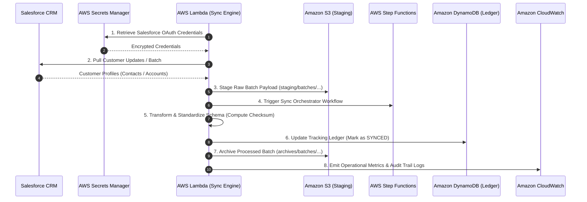

# Enterprise Customer Data Synchronization (Salesforce + AWS Serverless Stack)

An enterprise-grade, containerized Node.js application deployed to **AWS Lambda** that establishes an automated, secure, and bidirectional customer data pipeline between **Salesforce CRM** and the AWS Cloud ecosystem (**Amazon S3**, **Amazon DynamoDB**, **AWS Step Functions**, **Amazon CloudWatch**, and **AWS Secrets Manager**).

---

## 🏢 Business Context & Core Outcomes

### Primary Objective
Establish a seamless, automated, and bidirectional flow of customer information between the CRM (Salesforce) and the enterprise cloud data ecosystem, eliminating data silos across sales, customer service, and operations.

### Key Business Outcomes
- **Operational Efficiency**: Automates the transfer of customer updates, eliminating manual data entry.
- **Unified Customer View**: Guarantees a single, synchronized source of truth across all systems.
- **Cost Reduction**: Serverless container architecture scales to zero during idle periods.
- **Security & Compliance**: Centralized tracking, encrypted credentials vault, and auditable CloudWatch logs.

---

## 🛠️ Enterprise Toolset & Architectural Mapping

| Enterprise Tool | Architectural Role | Code Implementation |
|---|---|---|
| **Salesforce** | **Customer Engagement Hub**: Ingests updates, standardizes schemas, and receives cloud pushes. | [`src/services/salesforceService.js`](src/services/salesforceService.js) |
| **AWS Step Functions** | **The Digital Project Manager**: Orchestrates multi-stage sync workflow and handles automated retries. | [`src/services/sfnService.js`](src/services/sfnService.js) |
| **AWS Lambda** | **Task Execution Engine**: Serverless compute executing extraction, translation, and synchronization. | [`src/index.js`](src/index.js) |
| **Amazon S3** | **Secure Staging Area**: Temporary holding zone for batch customer payloads in transit. | [`src/services/s3Service.js`](src/services/s3Service.js) |
| **Amazon DynamoDB** | **The Tracking Ledger**: Sub-millisecond tracking database recording sync statuses, timestamps, and checksums. | [`src/services/dynamoService.js`](src/services/dynamoService.js) |
| **AWS Secrets Manager** | **The Digital Vault**: Encrypts and rotates Salesforce API tokens and credentials. | [`src/services/secretsManagerService.js`](src/services/secretsManagerService.js) |
| **Amazon CloudWatch** | **Enterprise Observability**: Emits business KPIs (`RecordsProcessed`, `Duration`) and audit logs. | [`src/services/cloudwatchService.js`](src/services/cloudwatchService.js) |

---

## 🔄 Architectural Workflow



---

## 🔑 LocalStack Community Edition (Zero License / Token Required)

This project uses **LocalStack 3.8 Community Edition** (`localstack/localstack:3.8`) in `docker-compose.yml`.

> [!TIP]
> **No Auth Token or License Required**: The community edition provides 100% free local emulation for S3, DynamoDB, Secrets Manager, Step Functions, and CloudWatch without ever asking for a `LOCALSTACK_AUTH_TOKEN` or Pro license activation.

---

## 🐳 Complete Docker & NPM Commands Reference

This section provides every NPM script and underlying Docker command required to build, spin up, monitor, test, and tear down the live containers.

### 1. Build the Docker Image

| Action | NPM Command | Underlying Docker Command |
|---|---|---|
| **Build Image** | `npm run docker:build` | `docker build -t enterprise-customer-sync-lambda:latest .` |
| **Build (Clean / No Cache)** | — | `docker build --no-cache -t enterprise-customer-sync-lambda:latest .` |

---

### 2. Make Containers Live Locally

#### Option A: Full Multi-Service Stack (LocalStack + Lambda Runtime Emulator) — *Recommended*
Spins up LocalStack (`port 4566`) with auto-provisioned S3 bucket, DynamoDB table, Secrets Manager vault, and SFN state machine alongside the Lambda container on `port 9000`.

| Action | NPM Command | Underlying Docker Command |
|---|---|---|
| **Start Live Stack (Foreground)** | `npm run docker:compose` | `docker compose up --build` |
| **Start Live Stack (Detached / Background)** | `npm run docker:compose:d` | `docker compose up -d --build` |

#### Option B: Standalone Lambda Container
Runs only the Lambda container with its built-in Runtime Interface Emulator (RIE).

| Action | NPM Command | Underlying Docker Command |
|---|---|---|
| **Run Standalone (Foreground)** | `npm run docker:run` | `docker run --rm -p 9000:8080 enterprise-customer-sync-lambda:latest` |
| **Run Standalone (Detached / Background)** | — | `docker run -d --rm -p 9000:8080 --name enterprise-sync-lambda enterprise-customer-sync-lambda:latest` |

---

### 3. Monitor & Inspect Live Containers

| Action | NPM Command | Underlying Docker Command |
|---|---|---|
| **Stream Live Container Logs** | `npm run docker:logs` | `docker compose logs -f` |
| **Check Running Containers Status** | `npm run docker:ps` | `docker compose ps` *(or `docker ps`)* |
| **Inspect Lambda Container Logs** | — | `docker logs -f enterprise-sync-lambda-local` |

---

### 4. Test Live Endpoints & Business Scenarios

Once the container is live on `localhost:9000`, test the pipeline using NPM scripts or direct `curl` commands in a separate terminal:

#### 🔄 Scenario 1: Trigger Full Enterprise Batch Sync
Pulls from Salesforce CRM, stages in S3, triggers Step Functions, updates the DynamoDB Ledger, and records CloudWatch metrics:
```bash
npm run sync:test:full
```
*Equivalent Direct curl:*
```bash
curl -XPOST "http://localhost:9000/2015-03-31/functions/function/invocations" \
  -d '{"action":"sync:batch","batchId":"BATCH-DAILY-001"}'
```

**Verified Live Response:**
```json
{
  "statusCode": 200,
  "body": {
    "success": true,
    "action": "sync:batch",
    "batchId": "BATCH-DAILY-001",
    "executionTimeMs": 973,
    "message": "Enterprise Customer Data Synchronization completed successfully.",
    "pipelineExecution": {
      "secretsManagerVault": { "status": "AUTHENTICATED", "secret": "enterprise/crm/salesforce-credentials" },
      "salesforceCRM": { "recordsIngested": 3, "source": "Salesforce-Enterprise-CRM" },
      "s3StagingArea": { "bucket": "enterprise-customer-sync-staging", "recordCount": 3 },
      "stepFunctionsOrchestrator": { "executionArn": "arn:aws:states:us-east-1:000000000000:execution:EnterpriseCustomerSyncStateMachine:...", "status": "RUNNING" },
      "dynamoTrackingLedger": { "table": "CustomerSyncLedger", "recordsTracked": 3, "status": "SYNCED" },
      "cloudWatchObservability": { "metricsPublished": ["RecordsProcessed", "RecordsSyncedSuccess", "BatchSyncDurationMs"] }
    }
  }
}
```

---

#### ⚡ Scenario 2: Real-time Single Customer Sync (Webhook)
Synchronizes an immediate single customer profile update into the DynamoDB Tracking Ledger:
```bash
npm run sync:test:realtime
```
*Equivalent Direct curl:*
```bash
curl -XPOST "http://localhost:9000/2015-03-31/functions/function/invocations" \
  -d '{"action":"sync:customer","customer":{"customerId":"CUST-99001","salesforceId":"0035g000001ABC1AAZ","fullName":"Alice Wayne","email":"alice.wayne@enterprise.com","tier":"Diamond Enterprise","checksum":"sha256-hash-01"}}'
```

---

#### 🔁 Scenario 3: Bidirectional Push to Salesforce CRM
Pushes customer updates initiated within the enterprise data cloud back to Salesforce:
```bash
npm run sync:test:push-crm
```
*Equivalent Direct curl:*
```bash
curl -XPOST "http://localhost:9000/2015-03-31/functions/function/invocations" \
  -d '{"action":"salesforce:push","customer":{"customerId":"CUST-99002","salesforceId":"0035g000002DEF2BBZ","firstName":"Bruce","lastName":"Wayne","email":"bruce.wayne@enterprise.com","tier":"Platinum","phone":"+1-555-0900"}}'
```

---

#### 📊 Scenario 4: Query the DynamoDB Tracking Ledger
Inspects the current synchronization state of customer records:
```bash
npm run sync:test:ledger
```
*Equivalent Direct curl:*
```bash
curl -XPOST "http://localhost:9000/2015-03-31/functions/function/invocations" \
  -d '{"action":"ledger:query"}'
```

**Verified Live Ledger Output:**
```json
{
  "statusCode": 200,
  "count": 3,
  "ledgerRecords": [
    { "customerId": "CUST-1ABC1AAZ", "fullName": "Sarah Connor", "syncStatus": "SYNCED", "tier": "Platinum Enterprise" },
    { "customerId": "CUST-2DEF2BBZ", "fullName": "Marcus Vance", "syncStatus": "SYNCED", "tier": "Gold" },
    { "customerId": "CUST-3GHI3CCZ", "fullName": "Elena Rostova", "syncStatus": "SYNCED", "tier": "Enterprise Diamond" }
  ]
}
```

---

#### 📦 Scenario 5: Inspect Amazon S3 Staging Batches
Lists staged batches currently in transit in Amazon S3:
```bash
npm run sync:test:s3-batches
```
*Equivalent Direct curl:*
```bash
curl -XPOST "http://localhost:9000/2015-03-31/functions/function/invocations" \
  -d '{"action":"s3:list-batches"}'
```

---

### 5. Stop & Clean Up Live Containers

| Action | NPM Command | Underlying Docker Command |
|---|---|---|
| **Stop & Remove Containers/Volumes** | `npm run docker:compose:down` | `docker compose down -v` |
| **Complete Stack Reset & Prune** | `npm run docker:clean` | `docker compose down -v && docker system prune -f` |

---

## ⚡ Fast Offline Unit Testing

To execute all unit tests with mock fixtures without launching Docker containers:
```bash
npm test
```

---

## ☁️ Deploying Live Container Image to AWS Lambda

When deploying to production AWS, the container image seamlessly switches from LocalStack to native AWS IAM execution roles and production Salesforce credentials.

### Step 1: Authenticate Docker with Amazon ECR
```bash
aws ecr get-login-password --region <AWS_REGION> | \
  docker login --username AWS --password-stdin <AWS_ACCOUNT_ID>.dkr.ecr.<AWS_REGION>.amazonaws.com
```

### Step 2: Build, Tag, and Push Container Image to ECR
```bash
# 1. Build image
docker build -t enterprise-customer-sync-lambda:latest .

# 2. Tag for Amazon ECR
docker tag enterprise-customer-sync-lambda:latest <AWS_ACCOUNT_ID>.dkr.ecr.<AWS_REGION>.amazonaws.com/enterprise-customer-sync-lambda:latest

# 3. Push to ECR repository
docker push <AWS_ACCOUNT_ID>.dkr.ecr.<AWS_REGION>.amazonaws.com/enterprise-customer-sync-lambda:latest
```

### Step 3: Create or Update AWS Lambda Function

#### Option A: Create New Lambda Function
```bash
aws lambda create-function \
  --function-name EnterpriseCustomerDataSync \
  --package-type Image \
  --code ImageUri=<AWS_ACCOUNT_ID>.dkr.ecr.<AWS_REGION>.amazonaws.com/enterprise-customer-sync-lambda:latest \
  --role arn:aws:iam::<AWS_ACCOUNT_ID>:role/EnterpriseCustomerSyncLambdaRole \
  --region <AWS_REGION> \
  --environment Variables="{S3_STAGING_BUCKET=enterprise-customer-sync-staging,DYNAMODB_LEDGER_TABLE=CustomerSyncLedger,SFN_STATE_MACHINE_ARN=arn:aws:states:<AWS_REGION>:<AWS_ACCOUNT_ID>:stateMachine:EnterpriseCustomerSyncStateMachine,SALESFORCE_SECRET_NAME=enterprise/crm/salesforce-credentials,CLOUDWATCH_NAMESPACE=Enterprise/CustomerSync,LOG_GROUP_NAME=/aws/lambda/enterprise-customer-sync}"
```

#### Option B: Update Existing Function Code
```bash
aws lambda update-function-code \
  --function-name EnterpriseCustomerDataSync \
  --image-uri <AWS_ACCOUNT_ID>.dkr.ecr.<AWS_REGION>.amazonaws.com/enterprise-customer-sync-lambda:latest \
  --region <AWS_REGION>
```

---

## 🤖 Antigravity CLI Integration

This repository includes:
- [AGENTS.md](file:///Volumes/MacDisk/Docker-Projects/docker-aws-cli/AGENTS.md): Workspace instructions and workflow commands for Antigravity AI pair programming.
- [.agents/rules/aws-lambda-docker.md](file:///Volumes/MacDisk/Docker-Projects/docker-aws-cli/.agents/rules/aws-lambda-docker.md): Antigravity coding conventions, AWS SDK v3 standards, and container guidelines.
