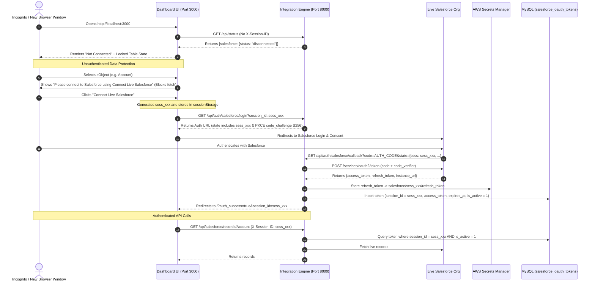

# System Architecture & Integration Patterns

This document details the architecture, data models, integration flows, and Docker topology for the Live Salesforce <-> AWS Integration Platform.

---

## 🏗️ System Topology

```
                               ┌───────────────────────────────────────────────┐
                               │         Live Salesforce Cloud (OAuth)         │
                               │           (https://login.salesforce.com)      │
                               └───────────────────────┬───────────────────────┘
                                                       │
                                   OAuth 2.0 Auth Code │ & Live REST/SOQL
                                   with PKCE (S256)    │
                                                       ▼
┌──────────────────────────────────────────────────────────────────────────────────────────────┐
│                                    Docker Compose Network                                    │
│                                                                                              │
│   ┌──────────────────────────────────────────────────────────────────────────────────────┐   │
│   │                         src/integration-engine (FastAPI)                             │   │
│   │                                   (Port 8000)                                        │   │
│   │  ┌───────────────────────┐  ┌──────────────────────┐  ┌───────────────────────────┐  │   │
│   │  │   OAuth 2.0 Service   │  │ LocalSecretsManager  │  │   SalesforceClient        │  │   │
│   │  │ (Session-Isolated PKCE)  │  (Boto3 / LocalStack)│  │   (Live SOQL & REST)      │  │   │
│   │  └───────────┬───────────┘  └──────────┬───────────┘  └─────────────┬─────────────┘  │   │
│   └──────────────┼─────────────────────────┼────────────────────────────┼────────────────┘   │
│                  │                         │                            │                    │
│                  ▼                         ▼                            ▼                    │
│   ┌───────────────────────────┐ ┌───────────────────────────┐ ┌──────────────────────────┐ │
│   │    MySQL Database (8.0)   │ │   AWS Secrets Manager     │ │     LocalStack AWS       │ │
│   │        (Port 3306)        │ │  (LocalStack / Cloud ARN) │ │       (Port 4566)        │ │
│   │ ┌───────────────────────┐ │ │ ┌───────────────────────┐ │ │ ┌─────────┐ ┌───────────┐ │ │
│   │ │ salesforce_oauth_     │ │ │ │ Refresh Tokens        │ │ │ │ AWS S3  │ │ DynamoDB  │ │ │
│   │ │ tokens (session_id)   │ │ │ │ (Never plain in DB)   │ │ │ ├─────────┤ ├───────────┤ │ │
│   │ ├───────────────────────┤ │ │ └───────────────────────┘ │ │ │ AWS SQS │ │ EventBridge│ │ │
│   │ │ salesforce_accounts   │ │ └───────────────────────────┘ └─────────┘ └───────────┘ │ │
│   │ ├───────────────────────┤ │                                                          │ │
│   │ │ salesforce_contacts   │ │                                                          │ │
│   │ ├───────────────────────┤ │                                                          │ │
│   │ │ salesforce_           │ │                                                          │ │
│   │ │ opportunities         │ │                                                          │ │
│   │ └───────────────────────┘ │                                                          │ │
│   └───────────────────────────┘                                                          │ │
│                  ▲                                                                           │
│                  │                                                                           │
│   ┌──────────────┴────────────┐                                                              │
│   │     src/dashboard-ui      │                                                              │
│   │    (Vercel CLI @ 3000)    │                                                              │
│   │ (sessionStorage Isolated  │                                                              │
│   │  & Toast Notification Engine)│                                                           │
│   └───────────────────────────┘                                                              │
└──────────────────────────────────────────────────────────────────────────────────────────────┘
```

---

## 🔐 Browser Session Isolation & Strict Access Control



---

## 🗄️ Database Schemas (MySQL)

### Table: `salesforce_oauth_tokens`
- `id` (INT, PK, Auto Increment)
- `session_id` (VARCHAR 100, Indexed)
- `salesforce_user_id` (VARCHAR 100)
- `salesforce_username` (VARCHAR 255)
- `salesforce_org_id` (VARCHAR 100)
- `instance_url` (VARCHAR 255)
- `access_token` (TEXT)
- `refresh_token_secret_arn` (VARCHAR 255)
- `token_type` (VARCHAR 50, Default 'Bearer')
- `issued_at` (DATETIME)
- `expires_at` (DATETIME, Indexed)
- `last_refreshed_at` (DATETIME)
- `is_active` (BOOLEAN, Default TRUE)
- `created_at` (DATETIME)
- `updated_at` (DATETIME)

### Table: `salesforce_accounts`
- `id` (INT, PK, Auto Increment)
- `salesforce_id` (VARCHAR 18, UNIQUE, Indexed)
- `name` (VARCHAR 255)
- `type` (VARCHAR 100)
- `industry` (VARCHAR 100)
- `phone` (VARCHAR 50)
- `website` (VARCHAR 255)
- `annual_revenue` (DECIMAL 18,2)
- `raw_payload` (JSON)
- `sync_status` (VARCHAR 50, Default 'SYNCED')
- `created_at` (DATETIME)
- `updated_at` (DATETIME)

### Table: `salesforce_contacts`
- `id` (INT, PK, Auto Increment)
- `salesforce_id` (VARCHAR 18, UNIQUE, Indexed)
- `salesforce_account_id` (VARCHAR 18, Indexed)
- `first_name` (VARCHAR 100)
- `last_name` (VARCHAR 100)
- `email` (VARCHAR 255, Indexed)
- `phone` (VARCHAR 50)
- `title` (VARCHAR 100)
- `raw_payload` (JSON)
- `sync_status` (VARCHAR 50, Default 'SYNCED')
- `created_at` (DATETIME)
- `updated_at` (DATETIME)

### Table: `salesforce_opportunities`
- `id` (INT, PK, Auto Increment)
- `salesforce_id` (VARCHAR 18, UNIQUE, Indexed)
- `salesforce_account_id` (VARCHAR 18, Indexed)
- `name` (VARCHAR 255)
- `stage_name` (VARCHAR 100)
- `amount` (DECIMAL 18,2)
- `probability` (DECIMAL 5,2)
- `close_date` (DATE)
- `raw_payload` (JSON)
- `sync_status` (VARCHAR 50, Default 'SYNCED')
- `created_at` (DATETIME)
- `updated_at` (DATETIME)

---

## 🛡️ Universal Zero-Trust Disconnected Data Guard

All data inspection and synchronization routes are wrapped with the `require_authenticated_salesforce_session` dependency:

```
[Unauthenticated Client Request]
                │
                ▼
   [Dependency: require_authenticated_salesforce_session]
                │
         Is session_id present & token active in MySQL?
                ├── No ──► [HTTP 401 Unauthorized] ──► Dashboard UI clears tables & renders locked banner
                │
                └── Yes ─► [Execute Route Handler] ──► Return requested data
```

### Protected Endpoints & UI Views
- **CRM Live Explorers:** `GET /api/salesforce/records/{sobject}`, `POST /api/salesforce/records/{sobject}`
- **Relational MySQL DB:** `GET /api/db/accounts`, `GET /api/db/contacts`, `GET /api/db/opportunities`
- **AWS Infrastructure:** `GET /api/aws/dynamodb/records`, `GET /api/aws/s3/files`, `GET /api/aws/s3/file`, `GET /api/aws/sqs/stats`
- **Secrets & Governance:** `GET /api/secrets`, `GET /api/logs`
- **Sync Triggers & UI:** `POST /api/sync/record`, `POST /api/sync/salesforce-to-aws`, `POST /api/sync/aws-to-salesforce` (Sync Pipelines tab is completely hidden when disconnected)

